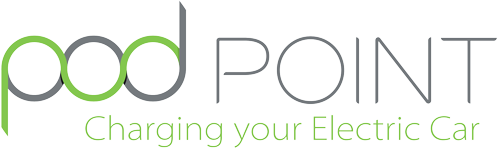

f

    

# Full stack coding test

Hi and welcome to our coding test for joining our Software Team!

***

**Table of Contents**

* [Presentation](#presentation)
* [The task](#the-task)
* [About you](#about-you)

***

***

## Presentation

This challenge is designed to test your full stack abilities (PHP/JS).

You should approach the task as you would any other piece of work in a typical day.
Think about the tools and libraries you might use to make your life easier (frameworks, libraries, etc.).

Think about your markup and CSS in terms of re-usability and maintainability across a larger scale product.

You should be able to produce the work with a high quality finish in an acceptable amount of time.

Design:

    <a href="./support/design.png">
        
         
        View High Resolution
    </a>

## The task

We need to build a very simple application that will be able to handle our units and give the ability to start/end a charge on a unit.

For this test you will need to implement this API, and build a simple frontend to list units & interact with units (start/stop a charge).

The test is split into 2 sections presenting the need for back end & front end:
* [see back end details](./docs/backend.md)
* [see front end details](./docs/frontend.md)

***

    <strong>Thanks and good luck!</strong>

***

## About you

* **First name:** `Calum`
* **Last name:** `Woodward`

***
